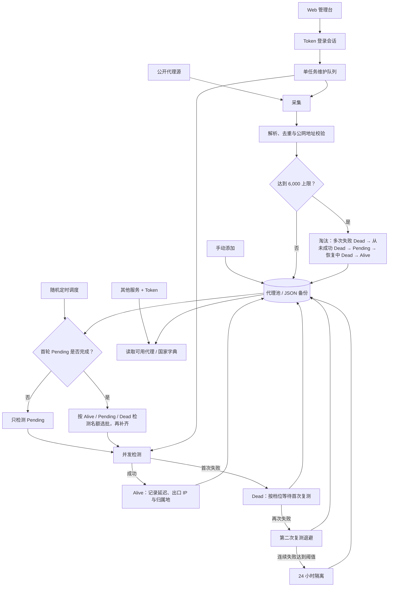

# ProxySiu

ProxySiu 是一个自托管的公开代理池维护工具：采集 HTTP、SOCKS4、SOCKS5 候选代理，按节奏检测可用性，并提供独立 Web 管理台和供其他服务读取可用代理的 API。

## 当前设计

- 后端：.NET 10 Minimal API、JSON 持久化与后台维护任务。
- 前端：Vue 3、Vite、Element Plus；开发和生产均与 API 分离。
- 部署：Docker Compose 启动 `web` 与 `api` 两个容器；仅 Web 映射到宿主机 `127.0.0.1:5173`，API 只在 Compose 内网可见。
- 认证：浏览器以 Token 登录，换取 `HttpOnly`、`Secure`、`SameSite=Strict` 会话 Cookie；Token 不保存到浏览器。其他服务用同一 Token 调用只读代理 API。
- 数据：运行数据存储在 `data/proxy-pool.json`，写入时保留 `.bak` 恢复副本；浏览器会话加密密钥也存于 `data/data-protection-keys`。Compose 使用命名卷 `proxy-data` 持久化二者。
- 归属地：成功检测时通过 `api.ip.sb` 获取出口 IP 与国家/地区/城市；仅可用代理在管理台展示归属地，并可按国家筛选或提取。

## 代理维护流程



## 调度与容量策略

`MaxPoolSize`（默认 `6000`）是所有档位共享的硬上限，不是必须填满的目标。档位只影响请求速率、每批数量和复测节奏。

池满时，新候选仍可进入。优先淘汰顺序如下：

1. 连续失败达到阈值的 Dead；
2. 从未检测成功过的 Dead；
3. Pending；
4. 曾经 Alive、但暂时失败的 Dead；
5. Alive。

被容量淘汰或清理的候选会进入 24 小时重入隔离，避免同一地址被采集源立刻反复加入。Dead/Pending 默认在连续 12 小时未出现在成功采集结果中后清理；连续失败达到阈值且长期失效的 Dead 也会清理。固定或手动保留的 `Pinned` 记录不参与这些淘汰。

首次扫描尚未完成时，每批只处理 Pending，避免首次检测与复测碰撞。稳定阶段先给 Alive、Pending、Dead 保留本批检测名额，未使用容量依次由 Pending、Dead、Alive 的到期记录补齐。右上角“检测到期代理”只处理已经到期的记录；下方“强制检测一批”会忽略到期时间，但仍遵守本批上限和状态优先级。

| 档位 | 并发 | 每批上限 | 自动检测间隔 | Alive 复测 | Dead 首次 / 第二次复测 | 采集间隔 |
| --- | ---: | ---: | --- | --- | --- | --- |
| `high-throughput` | 36 | 400 | 5–15 分钟随机 | 30 分钟 | 1 小时 / 6 小时 | 120 分钟 ±15% |
| `idc-safe` | 10 | 100 | 15–30 分钟随机 | 60 分钟 | 3 小时 / 12 小时 | 240 分钟 ±15% |

连续失败达到默认阈值 3 次后，记录会进入 24 小时检测隔离；再次成功会清除隔离并恢复为 Alive。管理台可在没有维护任务运行时热切换档位，但这个切换只保存在当前进程内；重启后以 `.env` 的 `PROXYSIU_PROFILE` 为准。

## 任务与日志

系统同一时间只接受一个排队或运行中的维护任务。后台自动任务与手动任务共用该队列。

- 管理台顶部展示全局候选、可用、失效、待检测统计。
- “当前检测任务”面板只在检测实际运行时显示该任务的等待、进行中、成功、失败和进度；空闲时不把全局到期数量误显示为任务等待数。
- 控制台默认只保留维护任务的 `Information` 日志；每条任务日志含任务 ID、类型、开始/完成时间、耗时及处理统计。

右上角“检测到期代理”若没有记录到期，会提示“暂无到期代理”，这是正常结果而不是检测失败。

## VPS 部署（推荐）

前提：VPS 已安装 Docker Compose 与 Nginx，Nginx 负责公网 HTTPS 证书。

### 1. 创建生产配置

```bash
cp .env.example .env
openssl rand -base64 36
```

将随机值填入 `.env`，不要使用本地开发 Token：

```dotenv
PROXYSIU_PROFILE=idc-safe
PROXYSIU_ACCESS_TOKEN=replace-with-a-random-production-token
PROXYSIU_COOKIE_SECURE=true
PROXYSIU_MAX_POOL_SIZE=6000
PROXYSIU_REMOVE_UNSEEN_AFTER_HOURS=12
PROXYSIU_GEOIP_USE_IP_SB=true
PROXYSIU_GEOIP_IP_SB_LOOKUP_INTERVAL_SECONDS=2
```

`PROXYSIU_ACCESS_TOKEN` 至少 24 个字符，`.env` 不会提交到 Git。Compose 会将池容量、未见清理和 GeoIP 配置传给 API 容器。

### 2. 启动

```bash
docker compose up -d --build
docker compose logs -f
```

只会暴露 Web 容器到 `127.0.0.1:5173`；不要给 `api` 服务增加宿主机 `ports` 映射。API 在 Compose 内网绑定 `0.0.0.0:5080`，供 Web 容器访问；运行数据与 DataProtection 密钥位于 Docker 命名卷 `proxy-data`。

### 3. Nginx 反向代理

必须把 HTTPS 协议传给 Web 容器，否则安全 Cookie 无法正确工作。

```nginx
server {
    listen 443 ssl http2;
    server_name proxy.example.com;

    ssl_certificate /path/to/fullchain.pem;
    ssl_certificate_key /path/to/privkey.pem;

    location / {
        proxy_pass http://127.0.0.1:5173;
        proxy_set_header Host $host;
        proxy_set_header X-Real-IP $remote_addr;
        proxy_set_header X-Forwarded-For $proxy_add_x_forwarded_for;
        proxy_set_header X-Forwarded-Proto $scheme;
    }
}
```

```bash
nginx -t && systemctl reload nginx
```

打开 `https://proxy.example.com`，输入 `.env` 的 Token 登录。

### 4. 更新与 Token 轮换

```bash
git pull
docker compose up -d --build
```

修改 `.env` 的 Token、档位或池参数后执行：

```bash
docker compose up -d --force-recreate
```

旧浏览器会话会失效。

## 本地开发

根目录需要 `.env`；后端会从 `src/ProxySiu.Api` 向上查找该文件。

```powershell
Copy-Item .env.example .env

# 终端 1：API
dotnet run --project .\src\ProxySiu.Api

# 终端 2：Web 开发服务器
cd .\src\ProxySiu.Web
npm install
npm run dev
```

打开 `http://localhost:5173` 并用 `.env` 的 Token 登录。本地 HTTP 开发需保持 `PROXYSIU_COOKIE_SECURE=false`。API 仅监听 `http://127.0.0.1:5080`，Vite 会把 `/api` 转发到该地址；`dotnet run` 不提供 Web 页面。

## API 与权限

浏览器管理接口需要登录会话。Token 可用于以下只读代理接口，支持 `Authorization: Bearer` 或 `X-API-Key`：

```bash
curl -H "Authorization: Bearer $PROXYSIU_ACCESS_TOKEN" \
  'https://proxy.example.com/api/proxy/random?protocol=http&country=US'

curl -H "X-API-Key: $PROXYSIU_ACCESS_TOKEN" \
  'https://proxy.example.com/api/proxy/plain?protocol=socks5&country=CN'
```

| 方法 | 路径 | 权限 | 用途 |
| --- | --- | --- | --- |
| GET | `/api/proxy/countries?protocol=http` | Token 或浏览器会话 | 当前可用代理的国家字典与数量 |
| GET | `/api/proxy/random?protocol=http&country=US` | Token 或浏览器会话 | 返回一个匹配国家的可用代理 |
| GET | `/api/proxy/plain?protocol=socks5&country=CN` | Token 或浏览器会话 | 文本导出匹配条件的可用代理 |
| GET | `/api/dashboard` | 浏览器会话 | 池、调度与当前任务状态 |
| GET / POST / PUT / DELETE | `/api/proxies` | 浏览器会话 | 查询和管理候选代理 |
| GET / POST / PUT / DELETE | `/api/sources` | 浏览器会话 | 管理采集源 |
| POST | `/api/actions/scan`、`/check`、`/refresh`、`/prune` | 浏览器会话 | 发起维护任务 |
| GET | `/api/operations/{id}` | 浏览器会话 | 查询当前或最近完成的任务 |

`POST /api/actions/check?force=false` 只检测到期记录；`force=true` 忽略到期时间。维护请求返回 `202 Accepted`，如已有维护任务则返回 `409 Conflict`。

管理列表支持 `GET /api/proxies?country=US`；国家筛选仅针对具有 GeoIP 结果的可用代理。

## IP 归属地

默认检测地址为 `https://api.ip.sb/geoip`，请求通过待测代理发出，因此一次成功检测即可获得出口 IP 和归属地。支持解析 `?callback=getgeoip` 的 JSONP 响应，但服务端不需要使用该参数。

如果自定义检测地址没有返回归属地，后台会对成功得到的出口 IP 去重，并以默认每 2 秒一次的频率调用 `https://api.ip.sb/geoip/{IP}` 补全。无需下载或维护 MMDB；归属地是国家/地区/城市级信息，不是物理街道地址。

## 验证

```powershell
dotnet run --project .\tests\ProxySiu.Api.Tests\ProxySiu.Api.Tests.csproj

cd .\src\ProxySiu.Web
npm run build
```

## 安全边界

- 公开代理不可信，可能记录、篡改或重放流量；不要经由它们传输账号、Cookie、Token 或其他敏感数据。
- 默认拒绝私网、环回、链路本地和保留地址，避免代理源或待测地址被用于访问内网。
- 生产环境只暴露宿主机 Nginx 的 HTTPS 端口，保持 Compose API 无宿主机端口映射。
- 生产 Token 应独立、随机、可轮换；不要使用仓库示例或本地开发 Token。
