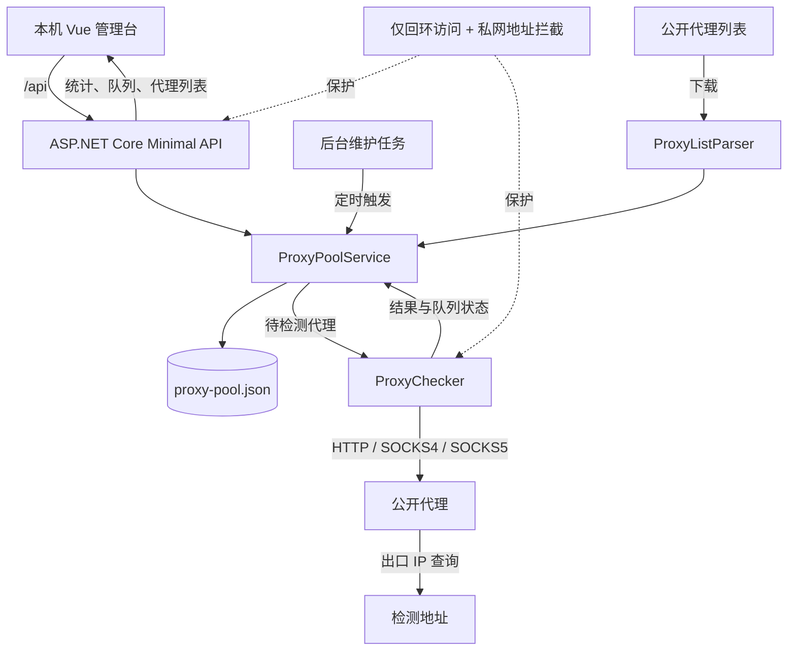

# ProxySiu

## Local-stability profile

This build is intentionally loopback-only. `AllowRemoteAccess=true` is rejected at startup; expose a future remote edition only after adding HTTPS, authentication, rate limiting, and audit logging.
The historical remote-management guidance later in this document is not enabled by this profile.

Maintenance actions (`/api/actions/scan`, `/check`, `/refresh`, and `/prune`) now return `202 Accepted` immediately with an operation resource. Poll `/api/operations/{id}` or `/api/dashboard` for queued, running, and completed state. Only one maintenance operation may be queued or running at a time.

The JSON store maintains a `proxy-pool.json.bak` last-known-good copy. If the primary file cannot be read on startup, the service restores the backup and retains a timestamped copy of the corrupt file for diagnosis.

Validation commands:

```powershell
dotnet build .\ProxySiu.slnx
dotnet run --project .\tests\ProxySiu.Api.Tests\ProxySiu.Api.Tests.csproj
cd .\src\ProxySiu.Web
npm run build
```

ProxySiu 是一个本地部署的公开代理池管理工具：定时拉取公开代理列表，自动检测 HTTP、SOCKS4、SOCKS5 代理是否可用，维护可用池，并通过 API 与 Vue 管理台提供查询和操作能力。

## 技术栈

- 后端：.NET 10 / ASP.NET Core Minimal API
- 前端：Vue 3 / Vite / Element Plus
- 持久化：JSON 文件，默认位于 `src/ProxySiu.Api/data/proxy-pool.json`

> 需求中的“.NET 19”没有对应的正式目标框架，本项目按当前机器已安装的 .NET 10 SDK 使用 `net10.0`。

## 工作流程



流程说明：后台任务负责采集、分批检测和清理；`ProxyPoolService` 统一维护队列与状态；管理台通过 API 读取实时统计。默认仅限本机访问，检测对象与采集源均经过公网地址安全校验。

## 本地运行

```powershell
cd src\ProxySiu.Web
npm install
npm run build

cd ..\ProxySiu.Api
dotnet run
```

打开 <http://localhost:5080>。前端开发模式可在 `src/ProxySiu.Web` 执行 `npm run dev`，Vite 会把 `/api` 转发到 5080 端口。

首次启动默认会在后台采集六个内置列表，并分批检测候选代理。安全默认值为检测并发 10、每批 200、可用代理 30 分钟复检、失效代理 180 分钟复检，自动任务会加入随机时间抖动。所有周期、并发数、超时、保留策略和默认采集源均可在 `appsettings.json` 的 `ProxyPool` 节点修改。

## 常用 API

| 方法 | 路径 | 用途 |
| --- | --- | --- |
| GET | `/api/dashboard` | 池统计和后台任务状态 |
| GET | `/api/proxies` | 分页查询代理，可传 `q/status/protocol/page/pageSize/sort/desc`；排序支持 `address/protocol/status/latency/successRate/lastChecked/firstSeen` |
| POST | `/api/proxies` | 手动添加代理 |
| POST | `/api/proxies/{id}/check` | 检测单个代理 |
| GET | `/api/proxy/random?protocol=http` | 随机获取一个低延迟可用代理 |
| GET | `/api/proxy/plain?protocol=socks5` | 文本导出可用代理 |
| GET/POST/PUT/DELETE | `/api/sources` | 管理公开列表采集源 |
| POST | `/api/actions/scan` | 立即采集 |
| POST | `/api/actions/check?force=false` | 检测到期代理 |
| POST | `/api/actions/refresh` | 采集后立即检测一批 |
| POST | `/api/actions/prune` | 清理长期失效代理 |

## 安全说明

公共代理不可信，可能记录、篡改或重放流量。不要通过公共代理传输账号密码、Cookie、API 密钥或其他敏感数据。服务默认拒绝私网、环回、链路本地和保留地址，降低采集源或代理地址被用于访问内网的风险；如确有内网代理需求，需显式设置 `AllowPrivateNetworks=true`。

服务默认只监听 `127.0.0.1:5080`，并在 `AllowRemoteAccess=false` 时拒绝非本机请求。管理 API 尚未配置身份认证；不要直接把 `AllowRemoteAccess` 改为 `true`，需要远程管理时应先配置带认证和访问控制的反向代理。

当前仅本机访问时不需要额外密钥或 Token。若后续需要从手机、局域网或公网打开管理页面，必须先启用 HTTPS 和身份认证：管理网页推荐使用账号密码登录后签发 `HttpOnly`、`Secure`、`SameSite` Cookie 会话，避免把固定 Token 写入前端或放在浏览器 `localStorage`；程序化 API 推荐使用独立的 `X-API-Key`，并区分只读代理获取与管理、触发检测等高权限操作。也可继续保持服务仅监听本机，再通过带访问认证的反向代理提供远程访问。
