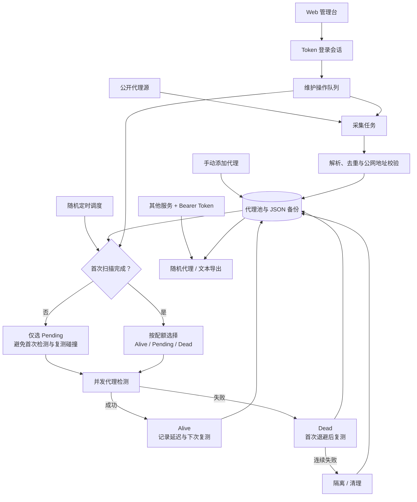

# ProxySiu

ProxySiu 是一个自托管的公开代理池：采集 HTTP、SOCKS4、SOCKS5 代理，分批检测可用性，并提供 Web 管理台和代理读取 API。

## 特性

- .NET 10 API + Vue/Vite 管理台，Docker Compose 使用两个独立容器。
- 首轮只检测未检测代理；稳定运行后为 Alive、Pending、Dead 保留检测名额，避免复测挤压首次检测。
- 可在管理台热切换检测档位；空闲面板 5 秒刷新，任务运行时 2 秒刷新。
- Token 登录后使用 `HttpOnly`、`Secure`、`SameSite=Strict` 会话 Cookie；Token 不保存在浏览器本地存储。
- 其他服务可使用同一 Token 读取可用代理，但不能调用管理、扫描或检测接口。
- 数据使用 JSON 持久化，并保留 `proxy-pool.json.bak` 备份用于故障恢复。

## IP 维护流程



首次阶段只消化 Pending；首次扫描完成后，每批为三种状态保留名额，未使用的容量由其他已到期记录补齐。失败代理按档位退避复测，连续失败后隔离，避免无效地址持续占用检测容量。

## VPS 部署（推荐）

前提：VPS 已安装 Docker Compose 和 Nginx，且 Nginx 负责 HTTPS 证书。

### 1. 配置 Token

在项目根目录创建生产配置：

```bash
cp .env.example .env
openssl rand -base64 36
```

将生成值填入 `.env`，不要使用本地开发 Token：

```dotenv
PROXYSIU_PROFILE=idc-safe
PROXYSIU_ACCESS_TOKEN=replace-with-a-random-production-token
PROXYSIU_COOKIE_SECURE=true
PROXYSIU_MAX_POOL_SIZE=6000
PROXYSIU_REMOVE_UNSEEN_AFTER_HOURS=12
```

`PROXYSIU_MAX_POOL_SIZE` 是池总量硬上限。达到上限时，优先淘汰失败次数更多、最后出现更早的 Dead，再淘汰 Pending；Alive 最后才会被淘汰。`PROXYSIU_REMOVE_UNSEEN_AFTER_HOURS` 会清理长期未出现在成功采集结果中的 Dead/Pending，并将其短期隔离，避免下一次采集立即回流。

`PROXYSIU_ACCESS_TOKEN` 至少应为 24 个字符，并且 `.env` 不会提交到 Git。

### 2. 启动容器

```bash
docker compose up -d --build
docker compose logs -f
```

Compose 只将 Web 容器发布到宿主机 `127.0.0.1:5173`；API 容器没有宿主机端口，不能被外网直接访问。运行数据存放于 Docker 命名卷 `proxy-data`。

### 3. 配置宿主机 Nginx

将域名反代到本机 Web 容器端口。必须传递 `X-Forwarded-Proto`，否则 HTTPS 下的安全 Cookie 无法正确工作。

```nginx
server {
    listen 443 ssl http2;
    server_name proxy.example.com;

    ssl_certificate /path/to/fullchain.pem;
    ssl_certificate_key /path/to/privkey.pem;

    location / {
        proxy_pass http://127.0.0.1:5173;
        proxy_set_header Host $host;
        proxy_set_header X-Real-IP $remote_addr;
        proxy_set_header X-Forwarded-For $proxy_add_x_forwarded_for;
        proxy_set_header X-Forwarded-Proto $scheme;
    }
}
```

```bash
nginx -t && systemctl reload nginx
```

现在访问 `https://proxy.example.com`，输入 `.env` 中的 Token 即可进入管理台。

### 4. 更新与 Token 轮换

```bash
git pull
docker compose up -d --build
```

Token 泄露时，修改 `.env` 的 `PROXYSIU_ACCESS_TOKEN` 后执行：

```bash
docker compose up -d --force-recreate
```

旧浏览器会话会失效。不要给 `api` 服务添加 `ports` 映射。

## 本地开发

根目录同样需要 `.env`；后端会从 `src/ProxySiu.Api` 向上查找该文件。

```powershell
Copy-Item .env.example .env

# 终端 1：API
dotnet run --project .\src\ProxySiu.Api

# 终端 2：Web 开发服务器
cd .\src\ProxySiu.Web
npm install
npm run dev
```

打开 `http://localhost:5173`，使用 `.env` 中的 Token 登录。本地 HTTP 开发应保持 `PROXYSIU_COOKIE_SECURE=false`；Compose 会强制使用 HTTPS 安全 Cookie。

API 仅运行在 `http://127.0.0.1:5080`。前端开发服务器将 `/api` 转发到该端口；`dotnet run` 不提供 Web 页面。

## 检测策略

| 档位 | 并发 | 每批上限 | 自动检测间隔 | Alive 复测 | Dead 复测 |
| --- | ---: | ---: | --- | --- | --- |
| `high-throughput` | 36 | 400 | 5–15 分钟随机 | 30 分钟 | 1 小时后首次、6 小时后再次 |
| `idc-safe` | 10 | 100 | 15–30 分钟随机 | 60 分钟 | 3 小时后首次、12 小时后再次 |

首次扫描尚未结束时，每批只处理 Pending，避免首次检测和复测碰撞。之后每批为各状态保留名额，未使用的名额再由其他到期记录补齐。连续失败的代理会退避并进入持久化隔离，采集源不会立即把它重新加入。

默认最多保留 6,000 条记录。源文件内容变化带来的新 IP 会参与容量淘汰，而不是让池无限增长；长期没有在成功采集中再次出现的 Dead/Pending 默认 12 小时后清理。修改 `.env` 后重启服务，首次采集或下一次“清理”任务会执行容量收敛。

启动档位由 `.env` 的 `PROXYSIU_PROFILE` 决定；管理台可在没有维护任务运行时热切换。

## API 与权限

浏览器管理接口需要登录会话。Token 只能用于以下只读代理接口：

```bash
curl -H "Authorization: Bearer $PROXYSIU_ACCESS_TOKEN" \
  'https://proxy.example.com/api/proxy/random?protocol=http'

curl -H "X-API-Key: $PROXYSIU_ACCESS_TOKEN" \
  'https://proxy.example.com/api/proxy/plain?protocol=socks5'
```

| 方法 | 路径 | 权限 | 用途 |
| --- | --- | --- | --- |
| GET | `/api/proxy/random?protocol=http` | Token 或浏览器会话 | 随机返回一个可用代理 |
| GET | `/api/proxy/plain?protocol=socks5` | Token 或浏览器会话 | 文本导出可用代理 |
| GET | `/api/dashboard` | 浏览器会话 | 池统计与任务状态 |
| GET / POST / PUT / DELETE | `/api/proxies` | 浏览器会话 | 查询和管理代理 |
| GET / POST / PUT / DELETE | `/api/sources` | 浏览器会话 | 管理采集源 |
| POST | `/api/actions/scan`、`/check`、`/refresh`、`/prune` | 浏览器会话 | 发起维护任务 |
| GET | `/api/operations/{id}` | 浏览器会话 | 查询维护任务进度 |

维护请求会立即返回 `202 Accepted`。同一时间最多存在一个排队或运行中的维护任务。

## IP 归属地

归属地依据代理检测成功后得到的出口 IP 查询，显示国家、地区和城市；它不是精确街道地址。查询使用本地 MaxMind GeoLite2 City 数据库，不会为每个代理额外请求第三方 API。

1. 注册并下载 [GeoLite2 City](https://dev.maxmind.com/geoip/geolite2-free-geolocation-data) 的 `GeoLite2-City.mmdb`。
2. VPS 部署时，将文件放入项目根目录的 `geoip/GeoLite2-City.mmdb`。
3. 重建并启动容器：`docker compose up -d --build`。

Compose 会将该目录以只读方式挂载到 API 容器。缺少数据库文件时，检测和代理池仍正常运行，只是不显示归属地；补上文件后重启即可。已有记录会在下次成功检测时补全归属地。

本地开发默认从 `src/ProxySiu.Api/data/GeoLite2-City.mmdb` 读取；也可在 `.env` 设置 `PROXYSIU_GEOIP_DATABASE_PATH` 指向任意本地 `.mmdb` 文件。

## 验证

```powershell
dotnet build .\ProxySiu.slnx
dotnet run --project .\tests\ProxySiu.Api.Tests\ProxySiu.Api.Tests.csproj
cd .\src\ProxySiu.Web
npm run build
```

## 安全边界

- 公共代理不可信，可能记录、篡改或重放流量；不要用它们传输账号、Cookie、Token 或其他敏感数据。
- 默认拒绝私网、环回、链路本地和保留地址，降低代理源被用于访问内网的风险。
- 生产环境只暴露宿主机 Nginx 的 HTTPS 端口；保持 Compose 的 API 无主机端口映射。
- 生产 Token 应独立、随机、可轮换；不要使用仓库示例或本地开发 Token。
